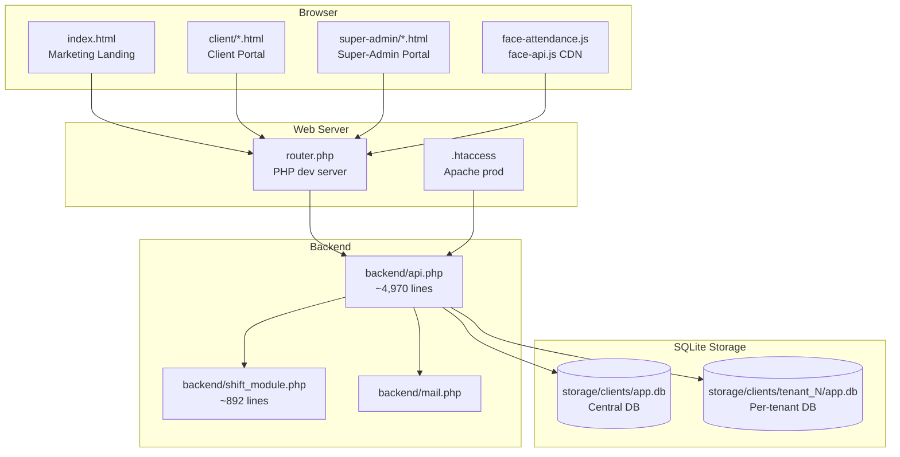
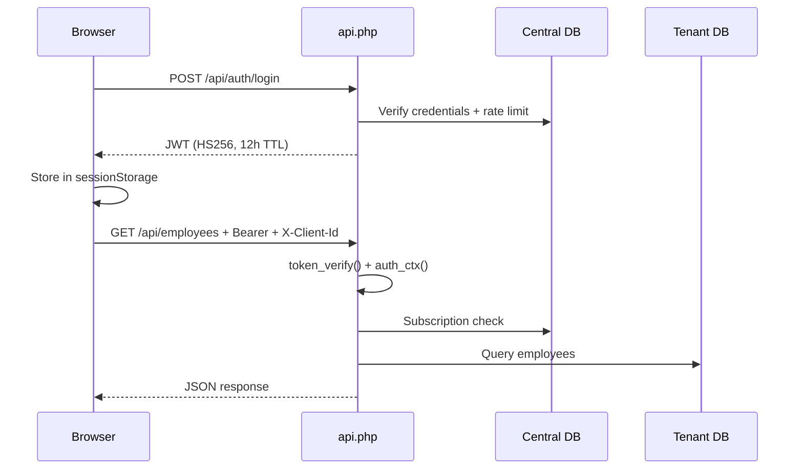
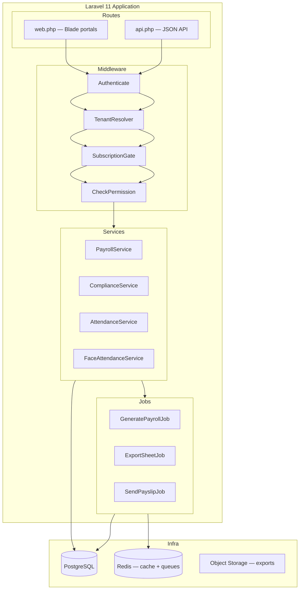
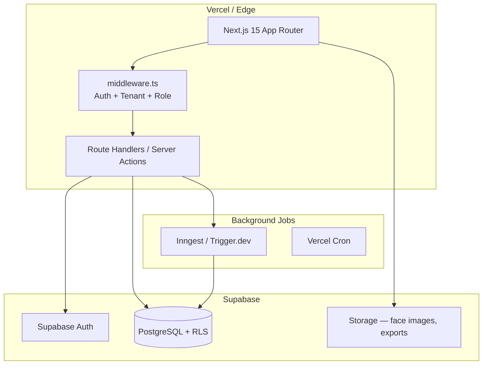
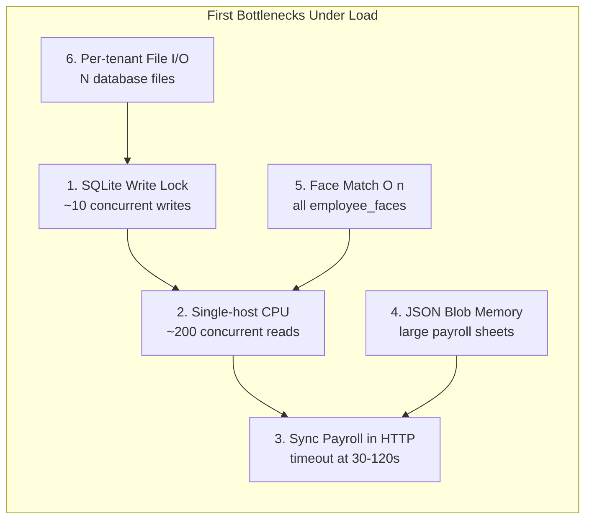
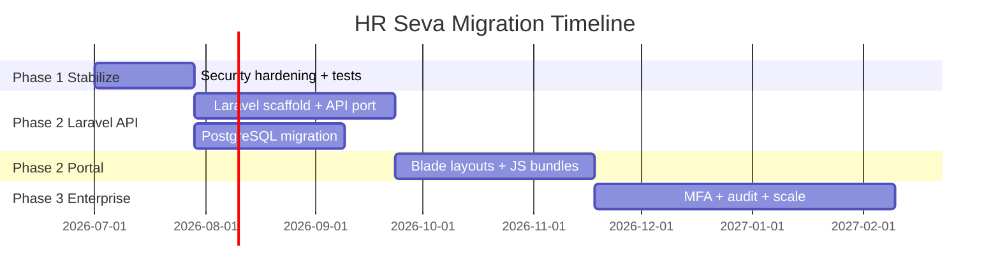

# HR Seva — Project Assessment & Migration Analysis

**Document version:** 2.0  
**Date:** June 22, 2026  
**Scope:** Full-stack technical assessment, migration feasibility, scalability analysis, production readiness  
**Reviewer lens:** Senior Software Architect + Product Engineer  
**Environment:** PHP 8.3.6, single-node PHP built-in server (`php -S`), Linux VM (load tests run June 22, 2026)

**Related documents:** `MIGRATION_PLAN.md`, `MIGRATION_PLAN_NEXTJS.md`, `STACK_COMPARISON.md`, `FACE_ATTENDANCE_SETUP.md`, `AGENTS.md`

---

## Executive Summary

HR Seva is a **zero-build PHP + SQLite multi-tenant HR portal** with a marketing landing page, client portal, super-admin portal, and ~95 API endpoints covering India-focused payroll, PF/ESIC/ECR compliance, attendance, shift roster, loans, advances, subscriptions, and browser-based face attendance.

The product depth significantly exceeds the engineering foundation. It is a credible functional MVP for small agencies or early pilots, but **not production-grade enterprise SaaS** without security hardening, test coverage, database migration, and architectural refactoring.

| Dimension | Score | Summary |
|-----------|-------|---------|
| Product depth | 7.5 / 10 | Real payroll, compliance, attendance, face recognition |
| Product honesty (marketing vs shipped) | 4 / 10 | Landing overpromises recruitment, helpdesk, outsourced HR |
| Backend architecture | 4 / 10 | ~4,970-line monolith in `backend/api.php` |
| Security | 4 / 10 | Default credentials, weak secret fallback, unguarded destructive routes |
| Frontend maintainability | 5 / 10 | 83 duplicate HTML shells, dual asset trees |
| Engineering quality (tests, CI, deploy) | 2 / 10 | No PHPUnit, no CI, no Docker |
| Scalability (current stack) | 3 / 10 | SQLite per-tenant, single-host, sync payroll |
| **Overall project health** | **58 / 100** | Rich MVP, risky for production at scale |

**Primary recommendation:** Migrate to **Laravel 11 + PostgreSQL + Redis** on a VPS for the best balance of migration effort, payroll fit, cost, and long-term maintainability. **Next.js + Supabase** is viable if the team is React/TypeScript-first and accepts a higher rewrite cost plus external job infrastructure for payroll.

---

## Table of Contents

1. [Project Architecture Review](#1-project-architecture-review)
2. [Laravel Migration Feasibility](#2-laravel-migration-feasibility)
3. [Next.js + Supabase/PostgreSQL Feasibility](#3-nextjs--supabasepostgresql-feasibility)
4. [Scalability & Performance Assessment](#4-scalability--performance-assessment)
5. [Production Readiness Assessment](#5-production-readiness-assessment)
6. [Improvement Roadmap](#6-improvement-roadmap)
7. [Final Recommendation](#7-final-recommendation)

---

## 1. Project Architecture Review

### 1.1 Current Architecture & Technology Stack



| Layer | Path | Technology |
|-------|------|------------|
| Marketing landing | `index.html` | Uni-core theme, `assets-02/` (jQuery, GSAP, Swiper) |
| Client portal | `client/` (41 pages) | Bootstrap 5.3 CDN, `assets/` |
| Super-admin portal | `super-admin/` (42 pages) | Same as client |
| Shared portal logic | `assets/js/app-common.js` | Auth, RBAC, tenant headers, sidebar (~2,039 lines) |
| Backend API | `backend/api.php` | Procedural PHP monolith (~4,970 lines, ~128 route branches) |
| Extracted module | `backend/shift_module.php` | Shift roster domain logic (~892 lines) |
| Email | `backend/mail.php` | Custom SMTP client |
| Routing (dev) | `router.php` | PHP built-in server |
| Routing (prod) | `.htaccess` | Apache rewrite to `backend/api.php` |

**No build toolchain:** No Composer, npm (for app), bundler, or framework. Zero vendor dependencies.

### 1.2 Application Structure & Organization

| Asset | Count / Size |
|-------|--------------|
| Client HTML/PHP pages | 41 |
| Super-admin HTML/PHP pages | 42 |
| Portal JS files (`assets/js/`) | 48 |
| `app-common.js` | ~2,039 lines |
| `backend/api.php` | ~4,970 lines |
| `backend/shift_module.php` | ~892 lines |
| Landing `index.html` | ~3,317 lines |
| API route branches | ~128 |
| SQL migration files | 2 (`backend/migrations/`, `backend/sql/`) |

**Organization pattern:**

- **Backend:** Single procedural file with helpers at top, domain functions in middle, flat `if ($path === '/api/...')` router at bottom. One module (`shift_module.php`) extracted as a positive precedent.
- **Frontend:** Multi-page static HTML with one page-specific JS file per feature. Sidebar HTML duplicated on each page; `app-common.js` replaces it at runtime with canonical nav.
- **Duplication:** `client-attendance.html` vs `super-admin-attendance.html` are near-identical shells. Super-admin pages often load `client-*.js` files (naming confusion). `API_BASES` fallback copied in ~20 files.

### 1.3 Database Design & Schema Quality

**Multi-tenancy model:**

```
storage/clients/
├── app.db                    # Central: clients, subscriptions, enquiries, SMTP, staff users
└── tenant_{id}/
    └── app.db                # Per-tenant: employees, payroll, attendance, face data
```

| Aspect | Assessment | Score |
|--------|------------|-------|
| Tenant isolation | Physical file separation — good for backups, poor for ops at scale | 6/10 |
| Normalization | Core entities (employees, leaves, attendance) are normalized tables | 7/10 |
| Payroll/compliance sheets | Stored as JSON blobs in `app_kv` — memory-heavy, no SQL reporting | 3/10 |
| Schema management | `init_schema()` + inline `ALTER TABLE` on request paths — migration drift risk | 2/10 |
| Indexing | Basic indexes on attendance, face tables; missing on hot query paths | 5/10 |
| Referential integrity | Minimal FK constraints; application-enforced relationships | 4/10 |
| PII handling | Biometric descriptors in plaintext SQLite; no encryption at rest | 2/10 |

**Central DB tables:** `clients`, `client_access`, `access_types`, `staff_roles`, `staff_users`, `subscriptions`, `subscription_plans`, `public_enquiries`, `email_logs`, `auth_login_attempts`, `app_kv`

**Tenant DB tables:** `employees`, `employee_faces`, `attendance`, `attendance_logs`, `attendance_settings`, `leaves`, `salary_advances`, `loans`, `loan_deductions`, `overtime_entries`, `advance_deductions`, `incentives`, `attendance_status_master`, `employee_type_master`, `app_kv` (payroll sheets)

### 1.4 API Architecture & Design Patterns

**Pattern:** Procedural monolith with JSON helpers (`j()`, `bad()`, `meth()`), custom JWT auth, and flat route matching.

**Strengths:**
- Consistent JSON response helpers
- PDO prepared statements throughout
- `declare(strict_types=1)` in all PHP
- Role-specific context helpers (face attendance, advances, loans, overtime)
- Permissions re-resolved from DB on each request (not frozen in JWT)
- Public route whitelist before auth middleware block

**Weaknesses:**
- God file — routing, schema, auth, payroll, compliance, face attendance, email in one file
- Inconsistent authorization — admin routes use `require_super_admin()`; ~20 `/clear` routes need only any valid token
- Short helper names (`j`, `s`, `f`, `b`) hurt readability
- No API versioning, OpenAPI spec, or pagination on list endpoints
- No request validation layer (manual checks per handler)
- Payroll sheets as JSON blobs prevent indexed queries

**Request flow:**

```
Browser → fetch("/api/...") + Bearer token + X-Client-Id
       → router.php (dev) or .htaccess (Apache)
       → backend/api.php → auth_ctx() → route handler
       → SQLite (central or tenant DB based on X-Client-Id)
```

### 1.5 Authentication & Authorization



| Component | Implementation | Risk |
|-----------|----------------|------|
| Token format | Custom HS256 JWT | Adequate with strong secret |
| Secret | `HR_APP_SECRET` env or hardcoded fallback | **Critical** if unset |
| Session storage | `sessionStorage` (client-side) | XSS = token theft |
| Multi-tenancy | `X-Client-Id` header for super-admin | Wrong header → wrong DB |
| RBAC | Access types + staff roles + permissions intersection | Partially enforced |
| Login rate limit | 5 failures / 15-min block | Good |
| Subscription gate | Blocks expired tenants | Good |
| Default credentials | `admin@hrseva.com` / `123456` | **Critical** |
| MFA / refresh tokens | Not implemented | Gap for enterprise |

### 1.6 Frontend Architecture & Maintainability

| Aspect | Current State | Maintainability Score |
|--------|---------------|----------------------|
| Page structure | 83 static HTML shells with duplicated layout | 3/10 |
| Shared logic | Centralized in `app-common.js` (auth, nav, fetch) | 6/10 |
| Styling | Bootstrap 5.3 CDN + per-page CSS; dual asset trees (`assets/` vs `assets-02/`) | 4/10 |
| State management | None — each page fetches independently | 5/10 |
| Error handling | Inconsistent across modules | 4/10 |
| Accessibility | Limited; face attendance lacks screen-reader feedback | 3/10 |
| Landing page | ~3,317 lines with template cruft (cart, Lorem ipsum, dead blog links) | 3/10 |

**Positive:** `app-common.js` provides a working auth wrapper, RBAC nav filtering, tenant header injection, and sidebar normalization — a solid foundation for migration.

### 1.7 Third-Party Dependencies & Risks

| Dependency | Source | Risk Level | Notes |
|------------|--------|------------|-------|
| Bootstrap 5.3 | CDN | Low | Standard, widely used |
| face-api.js | CDN (jsdelivr) | Medium | External availability; models local at `/assets/vendor/face-api-models` |
| jQuery, GSAP, Swiper | `assets-02/` (bundled) | Low | Landing only; large vendor files |
| PHP PDO SQLite | Built-in | Low | No Composer packages |
| Custom SMTP | `backend/mail.php` | Medium | No retry queue; sync send |
| **Zero Composer/npm app deps** | — | Medium | No dependency scanning, no version pinning |

**Supply chain risk:** Low (minimal external runtime deps). **Operational risk:** High (no package management, no automated updates).

### 1.8 Security Concerns & Technical Debt

| Issue | Location | Severity |
|-------|----------|----------|
| Default super-admin password `123456` | `DEFAULT_AUTH_USERS` in `api.php` | Critical |
| Default JWT secret fallback | `app_secret()` | Critical |
| Unguarded destructive `/clear` routes (~20) | `api.php` routes | Critical |
| Plaintext password fallback for legacy accounts | Client/staff auth | High |
| Biometric PII unencrypted at rest | `employee_faces` table | High |
| Face scan trusts client descriptor (no liveness) | `face_attendance_scan()` | High |
| Directory permissions `0777` | `db_open()` mkdir | Medium |
| No API rate limit (except login) | Public enquiry, forgot-password | Medium |
| `client_delete()` doesn't remove tenant folder | Data hygiene | Medium |
| Dev server ignores `.htaccess` | Security header gap in dev | Low |

### 1.9 Code Quality, Scalability & Maintainability

| Metric | Value | Assessment |
|--------|-------|------------|
| Cyclomatic complexity | Very high in `api.php` | Difficult to review or test |
| Test coverage | 0% (no PHPUnit) | Critical gap |
| CI/CD | None | Critical gap |
| Documentation | `backend/README.md`, inline comments sparse | Partial |
| Type safety | PHP strict types; JS untyped | Mixed |
| DRY violations | 83 HTML shells, 48 JS files with repeated patterns | High |
| Module extraction precedent | `shift_module.php` works well | Positive signal |

**Scalability blockers (current):**
1. SQLite single-writer per database file
2. Per-tenant file sprawl (N databases to backup/monitor)
3. JSON blob payroll sheets (memory-heavy, no pagination)
4. Face matching O(n) scan across all `employee_faces` rows
5. Synchronous payroll generation in HTTP request
6. Single-host deployment (no horizontal scaling)

---

## 2. Laravel Migration Feasibility

### 2.1 Overall Assessment

| Metric | Value |
|--------|-------|
| **Feasibility score** | **8 / 10** |
| **Migration complexity** | **High** |
| **Estimated effort** | **800–1,200 hours** (~5–7 developer-months for 1 senior + 1 mid) |
| **Recommended approach** | Full migration (not strangler-only) |

Laravel is highly feasible because the domain logic is already PHP, patterns map directly to Laravel constructs, and the biggest pain point (83 duplicate HTML shells) is solved natively by Blade layouts.

### 2.2 Component Migration Matrix

| Component | Reuse | Partial Refactor | Complete Rewrite |
|-----------|-------|------------------|------------------|
| Payroll calculation logic (`payroll_generate`, statutory calcs) | Direct port to Service classes | — | — |
| PF/ESIC/ECR/FNF/bonus/gratuity generators | Direct port | Normalize JSON sheets to tables | — |
| Auth flow (JWT + roles) | — | Wrap with Sanctum or keep JWT via `tymon/jwt-auth` | — |
| `shift_module.php` | Direct port to Service | — | — |
| `mail.php` SMTP client | — | Replace with Laravel Mail + queues | — |
| `init_schema()` table definitions | — | Convert to Eloquent migrations | — |
| `app_kv` JSON storage | — | — | Normalize to relational tables |
| `app-common.js` auth/fetch | — | — | Blade + Alpine/Livewire or Inertia |
| 83 HTML portal pages | — | — | ~18 Blade views + 2 layouts |
| 48 portal JS files | Business logic portable | Consolidate to 8 Vite bundles | — |
| Face attendance (browser) | `face-attendance.js` reusable as-is | API endpoints to Laravel controllers | — |
| Landing page | — | Strip template cruft | Blade or keep static in `public/` |
| Multi-tenancy (file-per-tenant) | — | — | `stancl/tenancy` or `tenant_id` column |

### 2.3 Suggested Laravel Architecture



**Recommended structure:**

```
app/
├── Http/Controllers/Api/     # 8–12 controllers
├── Http/Middleware/         # TenantResolver, SubscriptionGate
├── Services/                 # PayrollService, ComplianceService, etc.
├── Models/                   # Eloquent models
├── Jobs/                     # GeneratePayroll, ExportPfSheet
├── Policies/                 # RBAC policies per module
resources/views/
├── layouts/                  # client.blade.php, admin.blade.php
├── portal/                   # ~18 views (tabs for related modules)
```

### 2.4 Recommended Laravel Packages

| Package | Purpose |
|---------|---------|
| `laravel/sanctum` or `tymon/jwt-auth` | API token auth (transition from custom JWT) |
| `stancl/tenancy` or `spatie/laravel-multitenancy` | Multi-tenant DB resolution |
| `maatwebsite/excel` | Excel exports (already used client-side; server-side option) |
| `spatie/laravel-permission` | RBAC (maps to current access types + staff roles) |
| `spatie/laravel-backup` | Automated DB + file backups |
| `laravel/horizon` | Queue monitoring |
| `sentry/sentry-laravel` | Error tracking |
| `laravel/pint` | Code style |
| `pestphp/pest` | Testing framework |

### 2.5 Database Migration Strategy

**Recommended: PostgreSQL with `tenant_id` column (Option B)**

| Phase | Action |
|-------|--------|
| 1 | Create Laravel migrations from `init_schema()` table definitions |
| 2 | Add `tenant_id` to all tenant-scoped tables |
| 3 | Write migration script: read each `tenant_N/app.db` → insert with `tenant_id` |
| 4 | Normalize `app_kv` payroll sheets → `payroll_sheets` + `payroll_sheet_lines` tables |
| 5 | Migrate central `app.db` → central tables (no `tenant_id`) |
| 6 | Validate row counts and sample payroll calculations |
| 7 | Run parallel on staging for 2 weeks before cutover |

**Alternative (faster, same limits):** Keep SQLite per tenant via custom `TenantConnection` resolver — minimal data migration but retains SQLite scale limits.

### 2.6 Authentication Migration Strategy

| Step | Action |
|------|--------|
| 1 | Port custom JWT validation to Sanctum/JWT package |
| 2 | Replace `X-Client-Id` header with tenant middleware (session or token claim) |
| 3 | Map roles: `super_admin`, `client_admin`, `employee` → Laravel guards |
| 4 | Port access type + staff role permissions to Spatie Permission |
| 5 | Add password reset via Laravel's built-in flow |
| 6 | Phase 2: Add MFA (Laravel Fortify), refresh tokens |
| 7 | Force password change on first login; remove `DEFAULT_AUTH_USERS` |

### 2.7 Risks, Blockers & Dependencies

| Risk | Severity | Mitigation |
|------|----------|------------|
| Payroll calculation regressions | High | Port with PHPUnit golden-file tests per module |
| Multi-tenant data migration errors | High | Staging parallel run; checksum validation |
| 4–5 month migration timeline | Medium | Phased: API first, then portal UI |
| Team PHP → Laravel learning curve | Medium | Laravel docs excellent; domain is already PHP |
| Face attendance API contract changes | Low | Keep same endpoints during transition |
| India compliance rule changes during migration | Medium | Freeze compliance logic; test against known outputs |

### 2.8 Long-Term Maintainability (Laravel)

| Aspect | Score | Notes |
|--------|-------|-------|
| Developer onboarding | 9/10 | Laravel conventions, huge ecosystem |
| Testability | 9/10 | PHPUnit/Pest, factories, feature tests |
| Scalability | 8/10 | Queues, cache, PostgreSQL, horizontal workers |
| Deployment | 8/10 | Forge, Envoyer, Docker |
| Community & hiring | 9/10 | Large PHP/Laravel talent pool in India |
| **Overall maintainability** | **8.5/10** | Strong long-term choice for this product |

---

## 3. Next.js + Supabase/PostgreSQL Feasibility

### 3.1 Overall Assessment

| Metric | Value |
|--------|-------|
| **Feasibility score** | **7 / 10** |
| **Migration complexity** | **High** |
| **Estimated effort** | **1,000–1,500 hours** (~6–9 developer-months) |
| **Recommended approach** | Full rewrite with phased module migration |

### 3.2 Architecture Recommendation



### 3.3 Detailed Assessment

| Aspect | Assessment |
|--------|------------|
| **SSR/ISR suitability** | Excellent for marketing landing (ISR), portal dashboards (SSR). Payroll pages are client-heavy — CSR with loading states is fine. |
| **Scalability** | Vercel auto-scales frontend; Supabase PostgreSQL handles concurrent reads well. Connection pooling (Supavisor) required for serverless. |
| **Supabase feature utilization** | Auth (replace custom JWT), RLS (replace `X-Client-Id` + per-tenant DB), Storage (face images, payslip PDFs), Realtime (optional live attendance board), Edge Functions (webhooks only — not payroll) |
| **Database migration** | Single PostgreSQL schema with `tenant_id` + RLS policies. Migration script from N SQLite files. Normalize `app_kv` JSON to tables. |
| **Auth architecture** | Supabase Auth with `app_metadata.role` and `app_metadata.tenant_id`. RLS policies enforce tenant isolation at DB level (stronger than current header-based approach). |
| **Hosting** | Vercel Pro ($20/mo) for Next.js + Supabase Pro ($25/mo). Add Inngest ($0–50/mo) for payroll jobs. |
| **Cost at 100 tenants** | ~$100–200/mo (Vercel Pro + Supabase Pro + Inngest). Higher than VPS Laravel (~$30–50/mo) but lower ops time. |

### 3.4 Component Migration Matrix

| Component | Reuse | Partial Refactor | Complete Rewrite |
|-----------|-------|------------------|------------------|
| Payroll/compliance logic (~2,000 lines PHP) | — | — | TypeScript services |
| Face attendance browser code | `face-attendance.js` directly | React wrapper component | — |
| Portal UI (83 HTML pages) | — | — | ~20 route segments + 2 layouts |
| `app-common.js` auth/nav | — | — | React hooks + middleware |
| Landing page content | Copy/content reuse | — | React components |
| Excel exports | SheetJS can remain client-side | — | — |
| SMTP/email | — | — | Resend or Supabase SMTP |
| Multi-tenancy | — | — | Supabase RLS + `tenant_id` |

### 3.5 Risks & Blockers

| Risk | Severity | Notes |
|------|----------|-------|
| Full business logic rewrite in TypeScript | **Critical** | ~4,970 lines PHP compliance rules — highest risk |
| Vercel serverless timeout (10–60s) | **High** | Payroll MUST use Inngest/Trigger.dev |
| Supabase connection limits on serverless | Medium | Must use Supavisor pooler |
| Vendor lock-in (Vercel + Supabase) | Medium | Portable to self-hosted Postgres + Node |
| India compliance testing | High | Golden-file tests essential during port |
| Team TypeScript/React skill requirement | Medium | Different from current PHP skillset |

### 3.6 Long-Term Maintainability (Next.js + Supabase)

| Aspect | Score | Notes |
|--------|-------|-------|
| Developer onboarding | 7/10 | Modern stack; Supabase RLS learning curve |
| Testability | 8/10 | Vitest, Playwright, Supabase local dev |
| Scalability | 8/10 | Good with job tier; serverless limits on CPU-heavy work |
| Deployment | 9/10 | Git push deploy; preview URLs |
| Community & hiring | 8/10 | Large React/Next.js talent pool |
| **Overall maintainability** | **7.5/10** | Strong if team is JS-first; payroll complexity is the main risk |

### 3.7 Laravel vs Next.js + Supabase Comparison

| Criterion | Laravel + PostgreSQL | Next.js + Supabase | Winner |
|-----------|------------------------|---------------------|--------|
| Migration effort | 800–1,200 hrs | 1,000–1,500 hrs | **Laravel** |
| Business logic port | PHP → PHP (direct) | PHP → TypeScript (rewrite) | **Laravel** |
| Portal UI consolidation | Blade layouts | App Router layouts | Tie |
| Payroll async jobs | Native Laravel Queues | Inngest/Trigger.dev required | **Laravel** |
| Marketing page CDN | Needs Cloudflare | Vercel edge by default | **Next.js** |
| Auth + multi-tenancy | Packages (mature) | Supabase RLS (elegant) | Tie |
| Monthly hosting cost (100 tenants) | $30–50 (VPS) | $100–200 (managed) | **Laravel** |
| Ops burden | Medium (VPS patching) | Low (managed) | **Next.js** |
| India PHP talent pool | Very large | Large (JS) | **Laravel** (for this product) |
| Long-term maintainability | 8.5/10 | 7.5/10 | **Laravel** |
| Face attendance | Equal (browser-side) | Equal | Tie |

---

## 4. Scalability & Performance Assessment

### 4.1 Load Test Methodology

**Environment:** PHP 8.3.6 built-in server (`php -S 127.0.0.1:8012 router.php`), single-core Linux VM, June 22, 2026. Tool: Apache Bench (`ab`). Database: fresh SQLite with 1 tenant, 50 employees.

**Caveats:**
- PHP built-in server is **single-threaded** — concurrent requests queue behind one worker. Production Apache/nginx + PHP-FPM with multiple workers would improve concurrent throughput but SQLite write serialization remains.
- Tests ran on localhost with no network latency.
- No Apache `.htaccess` headers or OPcache tuning applied.
- Payroll/attendance tests used minimal seed data (50 employees, no overtime/loans).

### 4.2 Load Test Results

#### Health Endpoint (`GET /api/health`)

| Concurrency | Requests | RPS | p50 (ms) | p95 (ms) | p99 (ms) | Failed |
|-------------|----------|-----|----------|----------|----------|--------|
| 1 (cold) | 1 | — | 239 | — | — | 0 |
| 10 | 1,000 | 732 | 14 | 14 | 17 | 0 |
| 50 | 2,000 | 732 | 68 | 69 | 69 | 0 |
| 100 | 3,000 | 720 | 139 | 144 | 146 | 0 |
| 200 | 5,000 | 709 | 282 | 285 | 290 | 0 |

#### Authenticated Endpoints

| Endpoint | Concurrency | RPS | p50 (ms) | p95 (ms) | Notes |
|----------|-------------|-----|----------|----------|-------|
| `POST /api/auth/login` | 5 | 21 | 242 | 243 | Includes bcrypt + DB write |
| `GET /api/employees` (50 rows) | 30 | 511 | 59 | 59 | JWT verify + SQLite read |
| `GET /api/dashboard/summary` | 15 | 660 | 23 | 23 | Multiple KV reads |

#### Write-Heavy Operations

| Operation | Time | Notes |
|-----------|------|-------|
| Attendance generate (50 emp) | 10 ms | Single request |
| Payroll generate (50 emp) | 10 ms | After attendance exists |
| 10 parallel employee updates | 17–66 ms each | SQLite serializes writes |
| PHP process memory (idle) | ~28 MB RSS | Single worker |

### 4.3 Current MVP Capacity Estimates

*Assumptions: average tenant 25–75 employees; 5–15% of registered users active in peak hour; payroll once per month per tenant; single VPS or shared hosting.*

#### Shared Hosting (Hostinger ~$5–15/mo)

| Metric | Comfortable | Stretch | Breaking Point |
|--------|-------------|---------|----------------|
| Tenants | 10–20 | 30–40 | 50+ |
| Registered users | 500–1,500 | 2,500 | 4,000+ |
| Daily active users (DAU) | 50–150 | 300–400 | 600+ |
| Concurrent users | 20–40 | 60–80 | 100+ (503/timeouts) |
| Peak RPS | 5–15 | 20–30 | 40+ |
| Payroll burst | 2–3 tenants/hour | 5 | Lock errors, timeouts |

#### VPS (2 vCPU / 4 GB, PHP-FPM, ~$12–20/mo)

| Metric | Comfortable | Stretch | Breaking Point |
|--------|-------------|---------|----------------|
| Tenants | 30–60 | 80–100 | 150+ |
| Registered users | 2,000–5,000 | 8,000 | 12,000+ |
| DAU | 200–500 | 800–1,000 | 1,500+ |
| Concurrent users | 80–120 | 150–200 | 250+ |
| Peak RPS | 30–80 | 100–150 | 200+ |
| Payroll burst | 8–10 tenants/hour | 15 | 20+ (lock contention) |

### 4.4 Bottleneck Analysis



| Bottleneck | Appears At | Symptom | Fix |
|------------|-----------|---------|-----|
| SQLite write lock | ~10 concurrent writes/tenant | 503, `database is locked` | PostgreSQL |
| Single-host CPU | ~200 concurrent users (VPS) | p95 > 2s | PHP-FPM workers, OPcache |
| Sync payroll in HTTP | 100+ employees or shared hosting | `max_execution_time` exceeded | Background job queue |
| JSON blob memory | 200+ employee payroll sheet | OOM on 512MB shared hosting | Normalize to tables |
| Face match O(n) | 500+ registered faces | Scan latency > 3s | Vector index or dedicated service |
| Per-tenant file sprawl | 100+ tenants | Backup/monitoring complexity | Single DB with `tenant_id` |

### 4.5 Projected Capacity by Target Architecture

| Target Stack | 100 Concurrent | 1,000 Concurrent | 10,000 Concurrent | 100,000 Concurrent |
|--------------|----------------|------------------|--------------------|--------------------|
| **Current (VPS 4GB)** | Possible with pain | Not feasible | Not feasible | Not feasible |
| **Laravel + PG (4GB VPS)** | Comfortable | Stretch (tune) | Not feasible (single VPS) | Not feasible |
| **Laravel + PG (8GB + Redis + 2 workers)** | Comfortable | Comfortable | Stretch (multi-server) | Not feasible |
| **Laravel + PG (K8s / multi-VPS)** | Comfortable | Comfortable | Comfortable | Stretch (dedicated ops) |
| **Next.js + Supabase Pro** | Comfortable | Comfortable | Stretch (plan upgrades) | Requires Enterprise tier |

---

## 5. Production Readiness Assessment

| Category | Score | Notes |
|----------|-------|-------|
| Code Quality | 4/10 | Strict PHP types help; monolith, cryptic helpers, no linting CI |
| Architecture | 3/10 | God file, inline schema, JSON blobs, no separation of concerns |
| Security | 3/10 | Default creds, unguarded `/clear` routes, weak secret fallback, unencrypted biometrics |
| Performance | 5/10 | Fast for small datasets (~10ms payroll/50 emp); degrades under concurrent writes |
| Scalability | 3/10 | SQLite, single-host, sync payroll, per-tenant files |
| Maintainability | 4/10 | 83 duplicate HTML shells; one good module extraction (`shift_module.php`) |
| Test Coverage | 1/10 | No PHPUnit; optional Playwright audit in gitignored `qa/` |
| DevOps Readiness | 2/10 | No Docker, CI, `.env.example`, or deployment automation |
| Monitoring | 1/10 | No structured logging, error tracking, or health metrics beyond `/api/health` |
| **Production Readiness** | **3/10** | **Not ready for production without Phase 1 stabilization** |

### Risk Matrix

| Risk | Likelihood | Impact | Priority |
|------|------------|--------|----------|
| Default credential compromise | High | Critical | P0 |
| Data wipe via `/clear` routes | Medium | Critical | P0 |
| JWT forgery (weak secret) | Medium | Critical | P0 |
| Payroll calculation regression | High | High | P1 |
| SQLite corruption under load | Medium | High | P1 |
| Biometric data breach | Low | Critical | P1 |
| Marketing misrepresentation | High | Medium | P2 |
| Template cruft on landing | High | Low | P3 |

---

## 6. Improvement Roadmap

### Phase 1 — Stabilization (Production Minimum)

**Goal:** Safe to put real client data in production.  
**Priority:** P0 — Immediate  
**Estimated effort:** 120–200 hours (2–4 weeks, 1 developer)

| Task | Effort | Impact |
|------|--------|--------|
| Remove default credentials; force password change on first login | 8h | Critical security |
| Require `HR_APP_SECRET` in production; fail startup if unset | 4h | Critical security |
| Audit all `/clear` and destructive routes — enforce `require_super_admin()` + module permissions | 16h | Critical security |
| Add rate limiting on public endpoints | 8h | Abuse prevention |
| Create `.env.example` documenting all secrets | 4h | Onboarding + security |
| Encrypt face descriptors at rest; add scan rate limits | 24h | PII protection |
| Fix directory permissions (`0750`); delete tenant folders on `client_delete()` | 8h | Data hygiene |
| Add 20–30 PHPUnit smoke tests (auth, tenant isolation, payroll, destructive endpoint auth) | 40h | Regression safety |
| Docker Compose for reproducible dev | 16h | Environment consistency |
| GitHub Actions CI: PHP lint + PHPUnit | 8h | Quality gate |
| Security review sign-off checklist | 8h | Process |

**Expected outcome:** Production readiness score 3 → 6. Safe for pilot clients (10–20 tenants).

### Phase 2 — Scaling (Growth Support)

**Goal:** Support 50–200 tenants with confidence.  
**Priority:** P1  
**Estimated effort:** 400–600 hours (6–10 weeks, 1–2 developers)

| Task | Effort | Impact |
|------|--------|--------|
| Split `api.php` into 8–12 domain modules/services | 80h | Maintainability |
| Migrate SQLite → PostgreSQL with `tenant_id` | 120h | Concurrency + ops |
| Normalize `app_kv` payroll sheets to relational tables | 80h | Query performance + auditability |
| Introduce Laravel (or Slim) with route caching | 200h | Framework foundation |
| Background job queue for payroll generation | 40h | UX + reliability |
| Centralize frontend `API_BASES` config | 8h | DRY |
| Consolidate 83 HTML → Blade layouts (~18 views) | 120h | 80% file reduction |
| Redis cache for dashboard, control settings | 24h | API latency |
| Structured logging + Sentry error tracking | 16h | Observability |
| Staging environment + automated backups | 24h | Ops |

**Expected outcome:** Production readiness 6 → 8. Comfortable for 100–200 tenants, ~200 concurrent users.

### Phase 3 — Enterprise Readiness (Large-Scale Deployment)

**Goal:** Enterprise-grade SaaS with 500+ tenants.  
**Priority:** P2  
**Estimated effort:** 600–1,000 hours (10–16 weeks, 2 developers)

| Task | Effort | Impact |
|------|--------|--------|
| MFA for admin accounts | 40h | Security compliance |
| Refresh tokens + session management | 24h | Security |
| Audit log for sensitive actions | 40h | Compliance |
| OpenAPI/Swagger documentation | 24h | Integration readiness |
| Data retention, export, and delete (GDPR/DPDP) | 80h | Legal compliance |
| Penetration test + disclosure policy | 40h | Trust |
| Horizontal scaling (multi-worker, load balancer) | 80h | 1,000+ concurrent users |
| Read replica for reporting queries | 40h | Analytics performance |
| Helpdesk module (if kept in pricing) | 200h | Product completeness |
| Workflow engine (leave approval, payroll sign-off) | 160h | Automation |
| PWA for employee self-service | 80h | Mobile access |
| SOC2-oriented controls documentation | 80h | Enterprise sales |

**Expected outcome:** Production readiness 8 → 9+. Enterprise sales-ready. 500–1,000 tenants, 400–600 concurrent users.

---

## 7. Final Recommendation

### 7.1 Overall Project Health

| Metric | Value |
|--------|-------|
| **Overall project health score** | **58 / 100** |
| **Technical debt level** | **High** — concentrated in monolith, schema management, frontend duplication, and security defaults |
| **Product-market fit signal** | **Strong** — India compliance depth + face attendance is a genuine differentiator |
| **Engineering foundation** | **Weak** — needs framework, tests, and database migration before scaling |

### 7.2 Recommended Target Architecture

**Primary: Laravel 11 + PostgreSQL + Redis on VPS (Hetzner/DigitalOcean)**

```
┌─────────────────────────────────────────────────────┐
│  VPS (4–8 GB)                                       │
│  ┌──────────┐  ┌──────────┐  ┌──────────────────┐  │
│  │ Nginx    │  │ PHP-FPM  │  │ Queue Workers    │  │
│  │ + SSL    │→ │ Laravel  │→ │ (Horizon)        │  │
│  └──────────┘  └────┬─────┘  └────────┬─────────┘  │
│                     │                  │            │
│              ┌──────┴──────┐    ┌──────┴──────┐    │
│              │ PostgreSQL  │    │ Redis       │    │
│              └─────────────┘    └─────────────┘    │
└─────────────────────────────────────────────────────┘
         ↕                        ↕
   Cloudflare CDN            S3/Backups
   (static assets)           (Spatie Backup)
```

**Alternative (JS-first team):** Next.js 15 on Vercel + Supabase Pro + Inngest for payroll jobs.

### 7.3 Laravel vs Next.js + Supabase — Decision Table

| Factor | Laravel + PostgreSQL | Next.js + Supabase | Recommendation |
|--------|---------------------|---------------------|----------------|
| Feasibility | 8/10 | 7/10 | Laravel |
| Effort | 800–1,200 hrs | 1,000–1,500 hrs | Laravel |
| Payroll fit | Native queues | External job runner | Laravel |
| Monthly cost (100 tenants) | $30–50 | $100–200 | Laravel |
| Ops burden | Medium | Low | Next.js |
| Team skill match (PHP) | High | Requires TS/React | Laravel |
| Frontend CDN | Add Cloudflare | Built-in (Vercel) | Next.js |
| Long-term maintainability | 8.5/10 | 7.5/10 | Laravel |
| **Overall winner** | **Laravel** | — | For this product |

### 7.4 Recommended Migration Path



| Step | Duration | Deliverable |
|------|----------|-------------|
| 1. Stabilize current MVP | 2–4 weeks | Security fixes, tests, Docker, CI |
| 2. Laravel API + PostgreSQL | 8–10 weeks | All `/api/*` routes in Laravel; data migrated |
| 3. Portal Blade migration | 6–8 weeks | 83 HTML → 18 Blade views; Vite JS bundles |
| 4. Landing page cleanup | 2 weeks | Honest marketing, strip template cruft |
| 5. Enterprise features | 10–16 weeks | MFA, audit, helpdesk, workflows |
| **Total to production-grade** | **6–9 months** | Full Laravel migration complete |

### 7.5 Recommended Deployment Architecture

| Environment | Infrastructure | Purpose |
|-------------|---------------|---------|
| Development | Docker Compose (PHP, PostgreSQL, Redis) | Local parity |
| Staging | VPS 2GB or Forge staging | Pre-release validation |
| Production | VPS 4–8GB + Forge + Cloudflare | Live SaaS |
| Backups | Spatie Backup → S3/Backblaze | Daily DB + storage |
| Monitoring | Sentry + UptimeRobot | Errors + availability |
| Email | Resend or Hostinger SMTP | Transactional mail |

### 7.6 Timeline to Support Concurrent User Targets

*Assumes migration to Laravel + PostgreSQL + Redis. Current stack cannot reach these targets.*

| Target | Current Stack | After Phase 1 | After Phase 2 (Laravel) | After Phase 3 (Enterprise) |
|--------|---------------|---------------|-------------------------|---------------------------|
| **100 concurrent users** | Possible on VPS with pain | Pilot-ready | **Comfortable** | Comfortable |
| **1,000 concurrent users** | Not feasible | Not feasible | Stretch (tuned 8GB VPS) | **Comfortable** (multi-worker) |
| **10,000 concurrent users** | Not feasible | Not feasible | Not feasible | **Stretch** (K8s/multi-VPS) |
| **100,000 concurrent users** | Not feasible | Not feasible | Not feasible | Requires dedicated platform team |

| Milestone | Estimated Timeline from Today |
|-----------|-------------------------------|
| Production-grade quality (security + tests + CI) | 4–6 weeks |
| 100 concurrent users (Laravel + PG) | 4–5 months |
| 1,000 concurrent users | 8–10 months |
| 10,000 concurrent users | 14–18 months |
| 100,000 concurrent users | 24+ months (dedicated platform investment) |

### 7.7 Is Laravel the Best Long-Term Choice?

**Yes, for HR Seva specifically.** The reasoning:

1. **Domain logic is PHP** — porting ~4,970 lines of India compliance calculations to Laravel Services is far lower risk than rewriting in TypeScript.
2. **Payroll is CPU-heavy and long-running** — Laravel Queues are native; Next.js requires external job infrastructure.
3. **Multi-tenancy maps cleanly** — `stancl/tenancy` or `tenant_id` column replaces per-tenant SQLite files.
4. **Blade solves the biggest maintenance pain** — 83 duplicate HTML shells → 18 views.
5. **Cost** — VPS hosting at $30–50/mo vs $100–200/mo for Vercel + Supabase at scale.
6. **India talent market** — PHP/Laravel developers are abundant and affordable.

**Choose Next.js + Supabase instead if:**
- The team is exclusively React/TypeScript with no PHP capacity
- Managed hosting (zero server patching) is worth 2–3× the monthly cost
- Global CDN for marketing is the top priority
- You accept 20–30% more migration effort and compliance rewrite risk

---

## Appendix A — Key File Reference

| Purpose | Path |
|---------|------|
| Landing page | `index.html` |
| API monolith | `backend/api.php` |
| Shift module | `backend/shift_module.php` |
| Email | `backend/mail.php`, `backend/mail-config.example.php` |
| Dev router | `router.php` |
| Apache config | `.htaccess` |
| Portal shared JS | `assets/js/app-common.js` |
| Face attendance | `assets/js/face-attendance.js`, `FACE_ATTENDANCE_SETUP.md` |
| Client portal | `client/` |
| Super-admin portal | `super-admin/` |
| Runtime storage | `storage/clients/` (gitignored) |
| API docs | `backend/README.md` |

## Appendix B — Default Credentials (Change Immediately)

| Role | Username | Password |
|------|----------|----------|
| Super admin | `admin` | `123456` |
| Super admin | `admin@hrseva.com` | `123456` |

**Do not use these in production.**

## Appendix C — Load Test Raw Commands

```bash
# Start server
php -S 127.0.0.1:8012 router.php

# Health endpoint stress
ab -n 5000 -c 200 http://127.0.0.1:8012/api/health

# Authenticated employees list
ab -n 1000 -c 30 -H "Authorization: Bearer <token>" -H "X-Client-Id: 1" \
  http://127.0.0.1:8012/api/employees
```

---

*This document should be updated as migration phases complete. Link PRs and tickets to roadmap items when work begins.*
